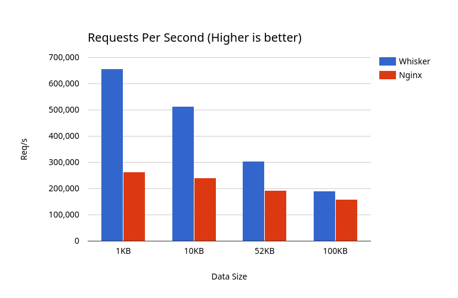
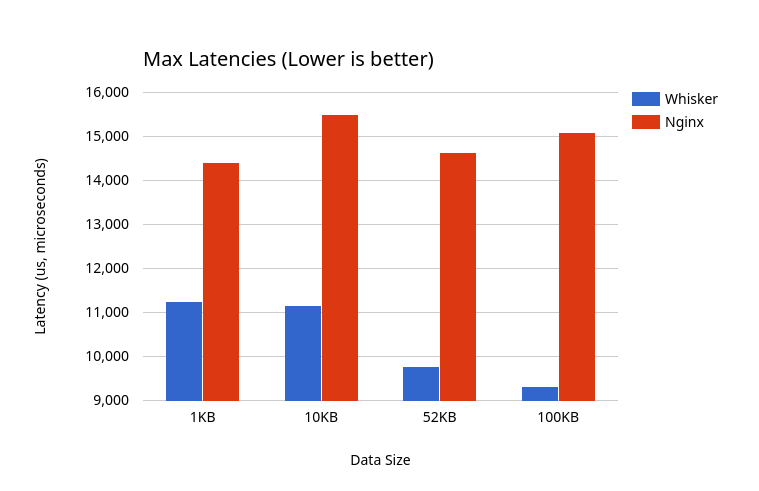
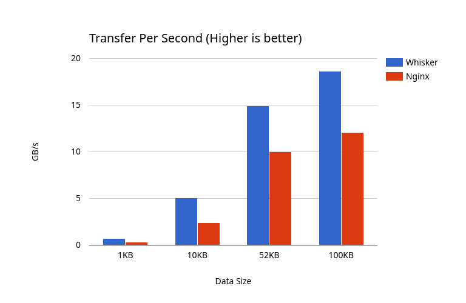

# Whisker

An opinionated, high performance server focused on simplicity and speed. Most sites serve a known set of assets, so why rely on runtime I/O or overly complex systems when you know what you need to serve?

Originally starting out as a curiosity project, it evolved into something I want to make real and production ready. This follows more of a static asset serving style rather than a traditional HTTP server as it stands, I plan to extend this into a production ready webserver as time goes on and support all forms of HTTP requests and protocols. By prioritising compile time computation over runtime overhead, it results in a faster, leaner, and sometimes even safer way to deliver content to the web.

## Benchmarks

 

 

 

 

 

## How it works

Starting the server is a two step process:

**1. Preprocess:**  

A bash script drives the build process, minifiying your content you wish to serve and generates cached files, hashes and a lookup table for the server. A basic config file exists in whisker.config

**2. Compiling:**  

Now one just recompiles the binary and your server is ready to serve the web! The bash script this does this automatically and the binary is in ```./build/bin/whisker``` 

 When parsing a request the URI is hashed with ```FNV-1a``` then a hash lookup is done. If the hash matches it sends the corresponding asset otherwise a 404 response is sent to the client. This design is extremely fast and inherently is secure, malicious or unknown requests simply fail to match any known hashes.

## Architecture

The server makes use of ```io_uring``` to manage connections and achieves **Zero Copy** communication (requires a modern Linux kerenl). It also makes use of a SIMD powered arena allocator, significantly reducing malloc/free calls to near zero. Everything is allocated up front during start up, reallocation support and growable buffers will be added, but in the mean time everything is allocated up front. There are zero file I/O and dynamic allocation calls during runtime. 
Currently the server only supports **HTTP/1.1**

## Roadmap

**HTTP** 
- Add POST next, and other methods down the line
- TLS/SSL and HTTPS
- Support more HTTP protocols

**Configuration**
- Configuration file and customisation
- Dynamic assets 
- Different asset types

**Tools**
- My own minifiers, I want to remove all dependencies

## Dependencies

- [cat-alyze (My own build tool, I will add Makefile support)](https://github.com/allocats/cat-alyze)  
- [html-minifier (HTML Minifier)](https://github.com/kangax/html-minifier)  
- [terser (JS Minifier)](https://github.com/terser/terser)   
- [csso-cli (CSS Minifier)](https://github.com/css/csso-cli) 
